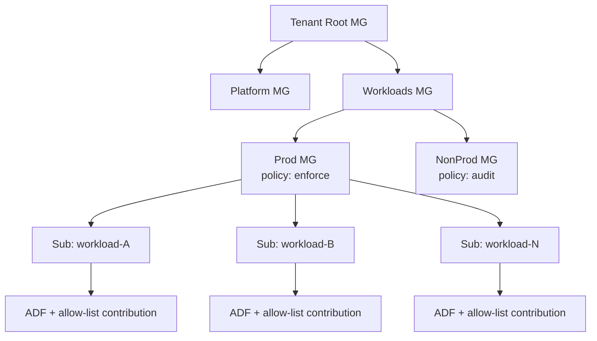
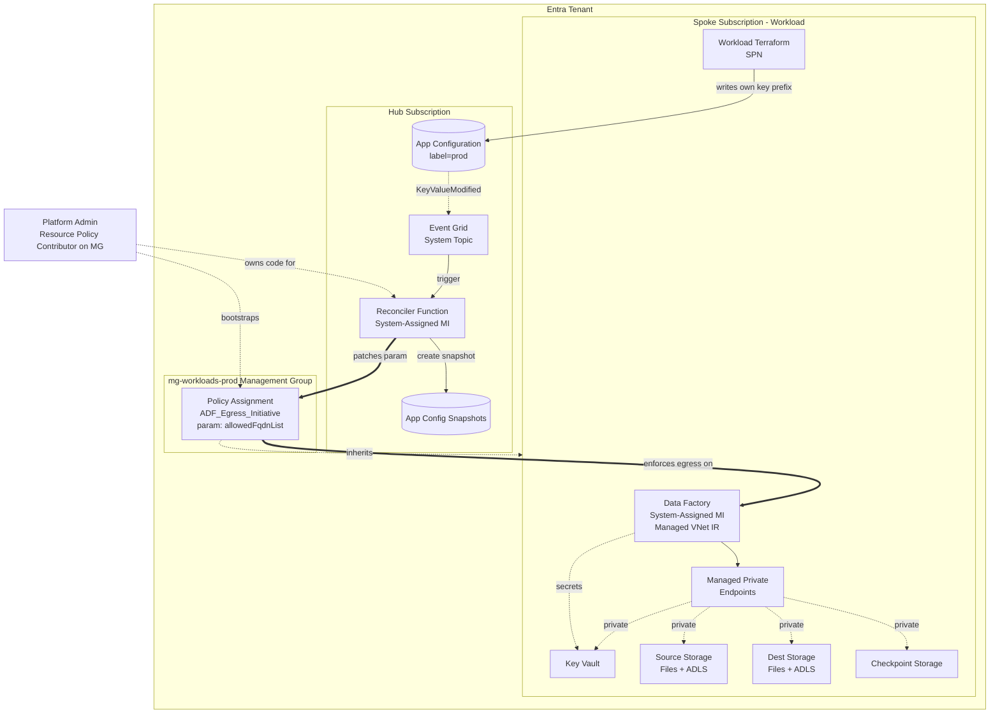
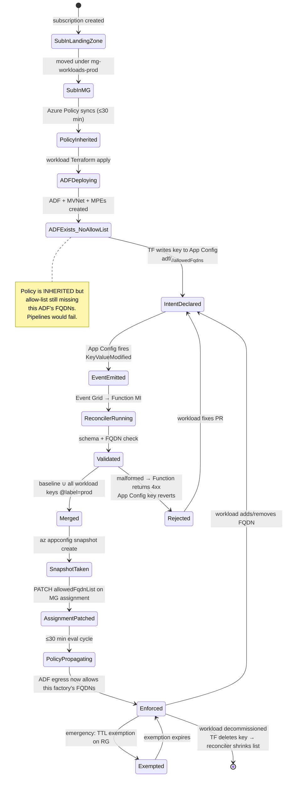
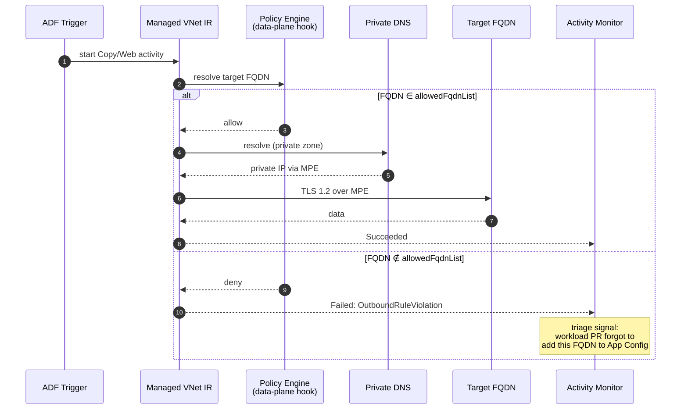
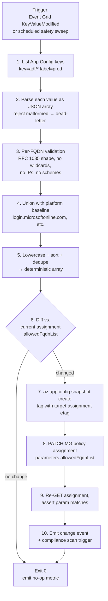
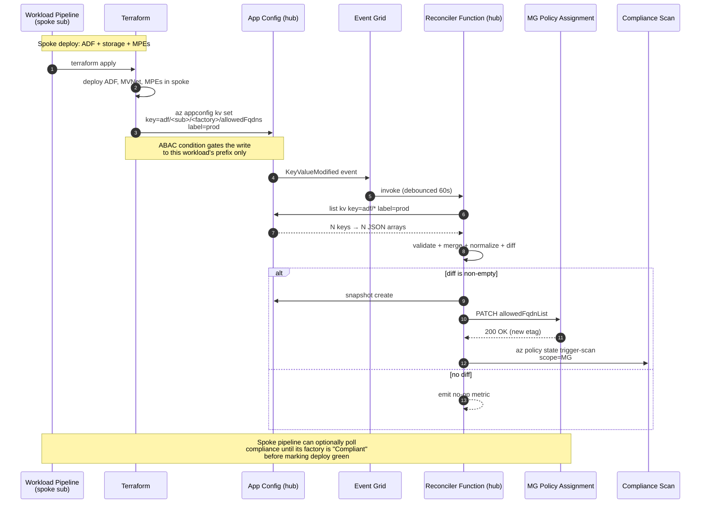
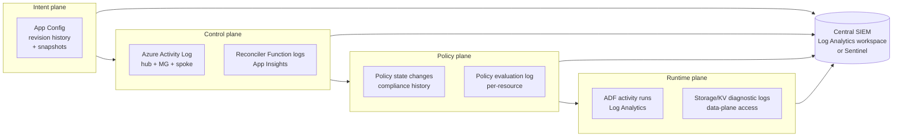
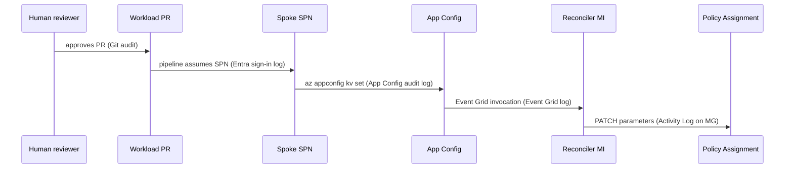

# ADF Outbound FQDN Policy: End-to-End Design

> Audience: engineers and architects coming to this repository for the first
> time and trying to understand how Azure Data Factory (ADF) outbound egress is
> (or will be) governed across a tenant of N workload subscriptions. This
> document captures the full design discussion that produced the approach so
> that the reasoning, not just the result, is preserved.

## Table of contents

1. [The problem and the chosen control](#1-the-problem-and-the-chosen-control)
2. [Single-subscription baseline](#2-single-subscription-baseline)
3. [Scaling to N subscriptions](#3-scaling-to-n-subscriptions)
4. [Allow-list source of truth: App Configuration](#4-allow-list-source-of-truth-app-configuration)
5. [Component and identity model](#5-component-and-identity-model)
6. [Lifecycle state diagram](#6-lifecycle-state-diagram)
7. [Runtime request flow](#7-runtime-request-flow)
8. [Spoke SPN permissions and ABAC](#8-spoke-spn-permissions-and-abac)
9. [Custom-role and assignment-count constraints](#9-custom-role-and-assignment-count-constraints)
10. [Reconciler design](#10-reconciler-design)
11. [Pipeline topology](#11-pipeline-topology)
12. [Terraform state and drift handling](#12-terraform-state-and-drift-handling)
13. [Audit and detection](#13-audit-and-detection)
14. [What this means for `azure-files-demo`](#14-what-this-means-for-azure-files-demo)
15. [Glossary](#15-glossary)

---

## 1. The problem and the chosen control

This repository deploys ADF with Managed VNet IR, managed private endpoints
(MPEs), customer-managed keys, RBAC-only Key Vault, and deny-by-default
storage networking. That stack closes inbound reach to the data stores, but it
leaves an egress gap: a compromised pipeline (a malicious Web activity, a
crafted linked service, an attacker with author rights on ADF) can still call
any public FQDN that Managed VNet can resolve. Typical exfiltration paths are
`Web`, `Webhook`, `Copy → HTTP/REST`, and `Azure Function` activities.

Microsoft ships a built-in Azure Policy definition that closes exactly that
gap by enforcing an FQDN allow-list on the ADF data plane:

- **Definition**: `ADF_Dataplane_Policies`
- **Id**: `/providers/Microsoft.Authorization/policyDefinitions/3d02a511-74e5-4dab-a5fd-878704d4a61a`
- **Parameter**: `allowedFqdnList` (JSON array of fully qualified domain names)
- **Reference**: <https://learn.microsoft.com/en-us/azure/data-factory/configure-outbound-allow-list-azure-policy>

It applies to Copy, Dataflows, Web, Webhook, and Azure Function activities,
plus authoring scenarios such as data preview and test connection. It does not
cover SSIS or Airflow. FQDNs must be exact — no wildcards or regex. Preview
throttling applies: 1,000 activity runs per 5 min per factory; 50,000 per 5 min
per subscription.

The policy enforces egress at the Azure control plane, independent of pipeline
code. That makes it the right outermost ring of defense: even pipelines written
by an attacker with author access to ADF cannot reach an FQDN the platform has
not approved.

## 2. Single-subscription baseline

For a single ADF in a single subscription (the shape of this repo today), the
minimum integration is one Terraform module that creates an
`azurerm_resource_group_policy_assignment` against the ADF's resource group,
referencing the built-in definition and passing the allow-list as a parameter.

The default allow-list derives from what the pipelines in
[terraform/modules/data_factory/pipeline.json](../terraform/modules/data_factory/pipeline.json)
actually call:

- `<source_fileshare_account>.file.core.windows.net`
- `<dest_fileshare_account>.file.core.windows.net`
- `<source_datalake_account>.dfs.core.windows.net`
- `<dest_datalake_account>.dfs.core.windows.net`
- `<source_datalake_account>.blob.core.windows.net` and
  `<dest_datalake_account>.blob.core.windows.net` (ADLS Gen2 Copy hits both
  endpoints)
- `<checkpoint_account>.blob.core.windows.net` (Web activities for cap and
  frontier blobs)
- `<key_vault_name>.vault.azure.net` (linked-service secret resolution)
- `login.microsoftonline.com`, `login.windows.net` (managed identity token
  acquisition)

After `terraform apply`, the ADF Studio "Manage → Outbound rules" toggle must
be enabled to activate enforcement. The deployer needs **Resource Policy
Contributor** at the assignment scope.

This baseline is sufficient for one factory. It does not scale, which is why
the rest of this document exists.

## 3. Scaling to N subscriptions

In a tenant with many workload subscriptions, per-RG assignments would mean N
PRs in N repos every time the policy itself changes, no central compliance
view, and N independently-drifting parameter sets. The right shape is:

- Promote the assignment to a **management-group scope** (for example
  `mg-workloads-prod`).
- Wrap the built-in definition in a **policy initiative** so related ADF
  guardrails can be versioned and rolled out as a unit.
- Use the same initiative twice with different enforcement modes:
  `DoNotEnforce` at NonProd, `Default` (enforce) at Prod.

This collapses N assignments into one per environment and lets a new
subscription inherit policy automatically the moment landing-zone automation
moves it into the MG.



The remaining design question is how each workload's specific FQDNs reach the
single MG-scoped `allowedFqdnList` parameter without each workload needing
write access to the assignment itself.

## 4. Allow-list source of truth: App Configuration

The Azure Policy engine does not perform runtime lookups against external
data sources. Policy parameters are static JSON baked into the assignment. So
the design choice is not "App Config as policy backend" but "what feeds the
pipeline that re-applies the assignment."

Two candidate contracts were considered:

| Pattern | Pros | Cons |
|---|---|---|
| Tag on each ADF | Zero new infra; discovery via Resource Graph | Stringly-typed, 256-char limit, no schema, no history, any ADF Contributor can change silently |
| **App Configuration key** | Typed JSON, labels for env separation, **change history + snapshots**, RBAC per key prefix, event-driven via Event Grid | One extra dependency (already present in this tenant), needs naming convention |

App Configuration is the right choice when it already exists at platform
level. The decisive factor is not the write path but **snapshots and change
feed**, which make rollback and forensics one-command operations.

### Key schema

- Key: `adf/<sub-id>/<factory-name>/allowedFqdns`
- Label: `prod` or `nonprod`
- Content type: `application/json`
- Value: lowercase JSON string array of FQDNs

The schema is chosen so the prefix decomposes along the trust boundary
(subscription → workload → factory). This matters because ABAC conditions can
only do prefix matching; getting the schema right at the start means
permissioning stays a one-liner forever.

### Hardening rules

- **RBAC the keys, not the store.** Each workload SPN gets
  `App Configuration Data Owner` on the store, ABAC-conditioned to its own key
  prefix. Without this condition, any workload could widen any other
  workload's allow-list.
- **Reconciler MI is the only writer to the policy assignment.** Workloads
  have zero RBAC on the policy assignment itself.
- **Validate on write.** Event Grid → Function hook rejects malformed JSON,
  wildcards, IPs, or scheme-prefixed strings before they reach the merge.
- **Snapshot before every apply.** `az appconfig snapshot create` gives a
  one-command rollback that is consistent with the policy state at the moment
  of patch.
- **Platform baseline stays in platform Terraform**, not in App Config.
  Tenant-wide FQDNs (`login.microsoftonline.com` and the like) are merged in
  by the reconciler so workloads cannot accidentally remove them.

## 5. Component and identity model



### Identity matrix

| Principal | Lives in | Required permissions | Notes |
|---|---|---|---|
| Platform admin | Tenant | `Resource Policy Contributor` on MG; `Contributor` on hub RG | Bootstraps assignment and reconciler |
| Reconciler Function MI | Hub sub | `App Configuration Data Reader` on App Config; `Resource Policy Contributor` on MG (ABAC-conditioned to one assignment) | Only principal that mutates the assignment in steady state |
| Workload Terraform SPN | Spoke sub | `Contributor` on spoke RGs; `App Configuration Data Owner` on App Config **ABAC-scoped by key prefix** | Cross-sub write to one key; nothing else cross-sub |
| ADF system MI | Spoke sub | `Storage Blob/File Data Contributor` on storage; `Key Vault Secrets User` on KV | No policy or App Config rights |
| Event Grid system topic | Hub sub | Implicit; created against the App Config resource | n/a |

Critical invariant: **workloads declare intent (write a key); only the
reconciler translates intent into policy state.** No workload principal has
direct write access to the policy assignment.

## 6. Lifecycle state diagram



Two branches matter operationally: **Rejected** (fail-closed at the App Config
boundary, before policy ever sees bad data) and **Exempted** (the only
legitimate bypass, time-bound, scoped to one RG).

## 7. Runtime request flow



Three layers of defense visible here, in order: **policy** decides whether the
FQDN may be contacted, **private DNS + MPE** decides how (forcing the route
inside the VNet), **storage/KV firewall + RBAC** decides what the caller may
do once connected. The policy is the new outermost ring; the rest already
exists in this repo.

Spoke ADF has **zero runtime dependency on the hub.** App Config and the
reconciler are only on the deploy/change path. If the hub is down, existing
pipelines keep running on the last-applied allow-list.

## 8. Spoke SPN permissions and ABAC

The spoke deployment pipeline's SPN needs **`App Configuration Data Owner`**
on the hub App Config resource, **constrained by an ABAC condition** that
pins it to its own key prefix:

```text
Principal: spoke workload's deployment SPN
Scope:     the App Config resource in the hub sub
Role:      App Configuration Data Owner
Condition: @Resource[Microsoft.AppConfiguration/configurationStores/keyValues:key]
           StringStartsWith 'adf/<spoke-sub-id>/'
```

Optionally pin the label too:
`@Request[...:label] StringEquals 'prod'`.

`Data Owner` is preferred over `Data Writer` because workload decommissioning
needs to delete the key (so the reconciler shrinks the allow-list); the ABAC
condition already caps blast radius so the extra verb is free.

### How the role assignment itself gets provisioned

Two patterns, pick one per org:

1. **Landing-zone automation owns it.** When a sub is moved into
   `mg-workloads-prod`, the landing-zone pipeline (running as a platform SPN
   with `User Access Administrator` on the hub App Config) creates the
   ABAC-conditioned assignment for the workload's SPN.
2. **Self-service via a deployment stack.** A published module the workload
   runs once in the hub under a short-lived PIM-elevated token to create its
   own ABAC assignment.

Either way, the spoke SPN's write to App Config is the **only** cross-sub
action it ever performs.

## 9. Custom-role and assignment-count constraints

The ABAC condition lives on the **role assignment**, not on the role
definition. Every workload uses the same built-in `App Configuration Data
Owner` role with a per-workload condition. Custom role limits are irrelevant.

What matters:

| Limit | Value | Relevant? |
|---|---|---|
| Custom roles per tenant | 5,000 | No (we use a built-in) |
| Role assignments per subscription | 4,000 | **Yes** — applies to the hub sub |
| Role assignments per MG | 500 | Only if assignments are pushed to MG |
| ABAC condition size | 8 KB | Trivial |
| ABAC conditions per assignment | 1 | Sufficient |

Headroom: ~3,500 workloads per hub sub at one assignment each, before the
4,000 limit matters. Patterns that burn budget unnecessarily and the
mitigations:

1. Per-factory SPNs instead of per-workload SPNs → use one SPN per workload+env
   with a prefix covering all that workload's factories.
2. Prod and nonprod sharing one App Config store → put them in separate hub
   stores (separate hub subs) for blast-radius reasons anyway.
3. Granting at `keyValues` child scope instead of store scope with a condition
   → always scope to the store, condition on the prefix.

ABAC operator limits to be aware of: prefix matching only (no regex); one
condition per assignment (use `OR` inside the single condition if needed).
The custom-role escape hatch — one custom role with bundled `dataActions`,
reused across N ABAC-conditioned assignments — exists but is not needed for
this design.

## 10. Reconciler design

The reconciler is small by design. It is the only mutator of the policy
assignment's `allowedFqdnList` in steady state.



Properties:

- **Idempotent.** Sort + dedupe + diff mean identical inputs always produce
  identical outputs; re-running is free.
- **Fail-closed at validation, fail-safe at patch.** Bad input never reaches
  Azure Policy. If patch fails, the snapshot plus unchanged assignment leaves
  the system in a known-good state with one-command rollback.

### Per-run structured event

This is the **single most important log line** for audit. Every reconciler
invocation must emit one structured event containing:

- `eventId` (from Event Grid; links back to the App Config change)
- `sourceKeys[]` with name, label, etag, and a hash of each value
- `mergedListHash` (detects "same inputs, different output" bugs)
- `snapshotName` (link to the immutable input snapshot)
- `targetAssignmentEtagBefore` / `targetAssignmentEtagAfter`
- `outcome` (`patched` / `noop` / `validation_failed` / `patch_failed`)

That record lets an auditor pivot in either direction — back to App Config,
forward to the policy assignment — without reading any other log first.

### Hourly safety sweep

Event-driven systems lie occasionally (dropped events, cold-start timeouts,
transient outages). A scheduled invocation of the same code path with the
same idempotency closes the gap. The sweep is a no-op 99% of the time.

## 11. Pipeline topology

Three pipelines, one direction of flow.



| Pipeline | Owner | Trigger | Touches |
|---|---|---|---|
| **Workload deploy** | Spoke team | Git push to workload repo | Spoke RGs; **one** key in hub App Config |
| **Reconciler** | Platform | Event Grid on App Config (+ hourly safety sweep) | App Config (read), MG assignment (patch), snapshots |
| **Landing-zone onboarding** | Platform | New sub moved into MG | Creates the spoke SPN's ABAC role assignment on App Config |

### Spoke-side footprint

From a workload team's perspective, this is three things:

1. Existing ADF / storage / MPE Terraform.
2. One `azurerm_app_configuration_key` against the hub provider alias,
   writing the workload's key.
3. Optional post-apply step polling
   `az policy state list --resource <adf-id> --filter "PolicyAssignmentName eq 'adf-egress'"`
   until the factory shows `Compliant`, with a timeout. This converts "did
   the platform pick up my change?" into a green/red pipeline step.

### Operational behaviors that fall out

- **Adding a workload:** one PR in the spoke repo. Zero platform PRs.
- **Removing a workload:** spoke TF destroys the key; reconciler shrinks the
  list on the next event.
- **Rollback a bad change:** `az appconfig snapshot restore <snap>` then
  trigger the reconciler. No `terraform apply` needed.
- **Audit "who added this FQDN":** App Config revision history on the key.
  The hub MI's activity log on the assignment shows only "reconciler patched
  at T+30s" — humans change intent, machines change state.

## 12. Terraform state and drift handling

The design has **two writers on one resource**: Terraform creates the
assignment, the reconciler mutates one of its parameters event-driven. If
Terraform ever decides to "fix" the parameter back to `.tfvars`, it wipes the
live allow-list. This must be defused explicitly.

Three options were considered:

| Option | Approach | Verdict |
|---|---|---|
| **A. `lifecycle.ignore_changes`** | Terraform owns shape, disowns `parameters` | **Recommended** |
| B. Split resource (azapi for parameter, azurerm for the rest) | Adds a third writer; sounds cleaner, worse in practice | Skip |
| C. Reconciler is also Terraform-driven | Pristine state; high latency, concurrency painful, more ops surface | Only if org policy mandates everything-in-state |

### Recommended pattern (Option A)

```hcl
resource "azurerm_management_group_policy_assignment" "adf_egress" {
  name                 = "adf-egress"
  management_group_id  = data.azurerm_management_group.workloads_prod.id
  policy_definition_id = azurerm_policy_set_definition.adf_egress.id
  enforce              = true

  parameters = jsonencode({
    allowedFqdnList = { value = var.platform_baseline_fqdns }
  })

  lifecycle {
    ignore_changes = [parameters]
  }
}
```

- Terraform bootstraps with the **platform baseline** so the system is
  functional from day one before any workload key exists.
- After bootstrap, the reconciler is the sole writer of `parameters`.
- `terraform plan` is clean forever, regardless of how many times the
  reconciler patches.

The state file holds a stale snapshot of `parameters` between refreshes. This
is acceptable because **nothing reads `parameters` from state** — the
reconciler reads the live API; Azure Policy evaluates from the live API. The
state file becomes intentionally non-authoritative for one field, by design.

### Guardrails that make Option A safe

1. **Drift detection that reads the live API**, not state — the same hourly
   safety sweep compares live `allowedFqdnList` to App Config's merged view.
   Mismatch alerts.
2. **A Terraform output that surfaces the truth.** Operators run
   `az policy assignment show --id $(terraform output -raw adf_egress_assignment_id)`
   instead of `terraform show`.
3. **The reconciler tags the assignment with `metadata.lastAppliedSnapshot`**
   on each patch. The live resource now carries a breadcrumb to the App Config
   snapshot that produced it, independent of Terraform state.

### Failure modes, explicitly defused

| Failure | Without `ignore_changes` | With Option A + guardrails |
|---|---|---|
| Engineer runs `terraform apply` after reconciler patched | Reverts allow-list to `.tfvars` baseline; pipelines fail | No diff on `parameters`; no-op |
| State file lost/corrupted | TF re-imports, sees drift, reverts | TF re-imports, sees drift on ignored field, does nothing |
| Reconciler bug writes wrong list | TF doesn't notice (it's ignoring the field) | Drift detector alerts within the hour |
| Manual portal edit to the policy | TF doesn't notice; reconciler overwrites on next event | Same — and the manual edit shows up in the drift alert before being overwritten |

The last row is the win: manual portal edits get auto-corrected by the next
reconciler run because the reconciler computes from App Config and patches
regardless of what's there. **App Config keys are the actual source of truth;
no out-of-band change survives longer than one reconcile cycle.**

## 13. Audit and detection

Security-grade audit must answer four questions on demand, for any point in
time:

1. **What was the allow-list?** (state at T)
2. **Who caused it to be that?** (intent → action chain)
3. **What did it permit or deny?** (runtime effect)
4. **Was anyone trying to bypass it?** (control-plane abuse)

Each question maps to an independent log source; corroboration across planes
is the audit property worth optimizing for.



### Q1 — "What was the allow-list at time T?"

- **Primary:** App Config snapshots (created by the reconciler before every
  patch). `az appconfig snapshot list` + `az appconfig kv list --snapshot`
  reconstructs exact input.
- **Corroborating:** Azure Resource Graph `resourcechanges` table for the
  policy assignment, cross-checked by etag and timestamp.
- **Retention:** snapshots kept indefinitely; export Resource Graph changes to
  Log Analytics (1–2 yr typical, 7 yr regulated).

### Q2 — "Who caused the change?"



Five hops, five logs, each owned by a different service. Forging "FQDN X was
added legitimately" requires fabricating entries in all five.

Required diagnostic settings:

- App Configuration → `HttpRequest` + `Audit` → Log Analytics.
- Event Grid system topic → `DeliveryFailures` + `PublishFailures`.
- Reconciler Function → Application Insights with the structured per-run
  event described in [§10](#10-reconciler-design).
- Management group → activity log → Log Analytics (captures policy assignment
  PATCH with calling principal).
- Entra ID → sign-in logs + SPN sign-in logs → Log Analytics.

### Q3 — "What did it permit or deny at runtime?"

- **Primary:** ADF activity run logs (`PipelineRuns`, `ActivityRuns`,
  `TriggerRuns`). Denials surface as `OutboundRuleViolation`. Querying gives
  the false-positive view: which legitimate workloads are blocked because
  they forgot to update their App Config key.
- **Corroborating:** storage and Key Vault diagnostic logs. A successful
  outbound call must show as a successful data-plane request at the target.
  Policy says "allowed" but storage shows no access → DNS/MPE problem.
  Policy says "denied" but storage shows access → **bypass; P0**.

### Q4 — "Was anyone trying to bypass it?"

The high-value detections, in priority order:

1. **Policy assignment modified by a principal other than the reconciler MI.**
   `AzureActivity | where OperationNameValue == "Microsoft.Authorization/policyAssignments/write" and Caller != "<reconciler-mi-object-id>"`.
   Should be zero outside platform TF applies.
2. **Policy exemption created** — `policyExemptions/write`. Always ticket;
   alert specifically on exemptions without an `expiresOn` field.
3. **App Config write by an SPN whose ABAC condition doesn't match the key
   written** — 403s with the SPN's object ID; repeated → boundary probe.
4. **Reconciler invocation with no preceding App Config change event.**
   Manual run; legitimate during incident response, suspicious otherwise.
5. **Enforcement mode flipped from `Default` to `DoNotEnforce`.** Stop-the-line
   alert; no legitimate prod reason.
6. **ADF created or modified outside the workload's deployment SPN.** Anyone
   creating an ADF in the portal sidesteps the App Config contract.

These six should be scheduled analytics rules in Sentinel (or Log Analytics
alerts), not dashboards. Dashboards get ignored.

### Compliance reporting layer

- **Azure Policy compliance dashboard** filtered to the initiative — tenant-
  wide percentage, drillable to factory level. The auditor-facing artifact.
- **Log Analytics workbook** joining reconciler events with the assignment's
  parameter history — a readable changelog of the allow-list.
- **Quarterly Entra ID access review** on the spoke SPNs' ABAC assignments in
  the hub — catches trust-boundary drift before it becomes an incident.

### Retention and immutability

- Log Analytics workspace: immutable archive tier for security data older than
  90 days; retention per regulatory baseline.
- App Config snapshots: never delete; cheap and authoritative for inputs.
- Activity log export: storage account with WORM/immutability policy on the
  assignment's RG/MG to defend against an attacker scrubbing Log Analytics.

## 14. What this means for `azure-files-demo`

This repo can demonstrate both topologies side by side without changing its
default behavior:

1. **Per-RG (single-sub) mode** — a new module
   `terraform/modules/adf_outbound_policy/` that creates an
   `azurerm_resource_group_policy_assignment` against the existing ADF's RG.
   Inputs come from `terraform/demo.tfvars` so the single-edit-point workflow
   is preserved. This is the minimum integration described in
   [§2](#2-single-subscription-baseline).
2. **MG-scoped (N-sub) mode** — an additional `platform/` example with:
   - `platform/policies/adf-egress/` — initiative wrapping the built-in
     definition.
   - `platform/assignments/{prod,nonprod}/` — MG-scoped assignments with
     `lifecycle.ignore_changes = [parameters]`.
   - `platform/reconciler/` — Function source + Terraform.
   - A stub spoke contribution showing the `azurerm_app_configuration_key`
     write the workload performs.

Operational additions when integrated:

- `scripts/execute-phase5-6.sh` should remind operators to enable the
  ADF Studio "Manage → Outbound rules" toggle after deploy.
- `scripts/validate-adf-health.sh` should add a regression test that runs a
  Web activity to a non-allow-listed FQDN and asserts it fails.
- The README and `.github/copilot-instructions.md` should add: **all new Web
  activity targets and linked-service hostnames must be added to the
  allow-list source (App Config key for MG mode, `.tfvars` for per-RG mode)
  or they will fail at runtime.** This is the trap that bites when extending
  pipelines later.

Documentation to align in the same PR when implementation lands: this file,
[README.md](../README.md), and `.github/copilot-instructions.md` per the
repo's existing rule that those stay in lockstep.

## 15. Glossary

- **ADF** — Azure Data Factory.
- **MVNet IR / Managed VNet IR** — Integration Runtime hosted in an Azure-
  managed VNet, the egress surface that the policy enforces against.
- **MPE** — Managed Private Endpoint; ADF's private route to a data store.
- **MG** — Management Group; the scope at which the assignment lives in the
  N-sub topology.
- **Hub subscription** — the platform-owned subscription hosting shared
  services: App Config, Event Grid, the reconciler Function.
- **Spoke subscription** — a workload-owned subscription hosting an ADF and
  its data stores.
- **Reconciler** — the platform-owned Function (or pipeline) that translates
  App Config intent into a policy assignment parameter patch.
- **Allow-list / `allowedFqdnList`** — the policy parameter; the JSON array
  of FQDNs ADF is permitted to egress to.
- **Initiative (policy set)** — bundle of related policy definitions
  versioned and assigned together.
- **ABAC condition** — attribute-based condition on a role assignment that
  scopes the assignment to resources matching a predicate (here, a key
  prefix).
- **Snapshot** — App Configuration's immutable point-in-time capture of keys
  by label; the audit-grade input record for every reconciler run.
